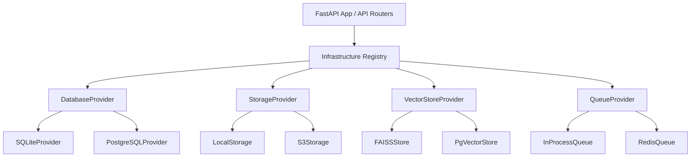

# Phase 9 · Module 4 — Production Deployment & Platform Engineering

This module completes the production orchestration, infrastructure virtualization, and high-availability architecture of the **LexiMind** platform. It introduces a modular, provider-agnostic infrastructure layer, dynamic resource schedulers for specialized AI workloads, policy-driven canary/feature flag management, automated disaster recovery playbooks, containerization, and a premium operations console.

---

## 1. Infrastructure Abstraction Layer

To ensure the platform is vendor-agnostic and highly extensible, all core subsystems communicate exclusively via interfaces. Concrete drivers are dynamically registered at runtime based on the environment's `DeploymentProfile`.

### Provider Interfaces
1. **`DatabaseProvider`**: Manages relational data access, session generation, transaction isolation, and health checks.
2. **`StorageProvider`**: Abstracts binary/object storage (local file system vs. AWS S3).
3. **`VectorStoreProvider`**: Virtualizes vector search, embeddings mapping, index querying, and index persistence.
4. **`QueueProvider`**: Powers asynchronous task dispatching (In-process vs. Redis).
5. **`DeploymentProvider`**: Interface for horizontal scaling operations.

---

## 2. Environment-Aware Deployment Profiles

The platform supports three distinct runtime environments, dynamically configured via the `LEXIMIND_PROFILE` environment variable:

| Profile Name | Target Use Case | Database Provider | Vector Store Provider | Storage Provider |
| :--- | :--- | :--- | :--- | :--- |
| **DEVELOPMENT** | Local developer machines | `SQLiteProvider` | `FAISSStore` | `LocalStorage` |
| **TESTING** | Unit/Integration CI testing | `SQLiteProvider` (In-Memory) | `FAISSStore` (In-Memory) | `LocalStorage` (In-Memory) |
| **PRODUCTION** | Kubernetes cluster | `PostgreSQLProvider` | `PgVectorStore` | `S3Storage` |

*Resilience Note*: The `PostgreSQLProvider` automatically falls back to an in-memory SQLite provider if `psycopg2` or Postgres database cluster is offline/unavailable, ensuring that development/testing suites collect cleanly without heavy production drivers.

---

## 3. Specialist Worker Pools & AI Resource Scheduler

LexiMind manages compute-heavy AI operations (Transcription, Embedding generation, Graph construction, Reasonings) through a prioritized, resource-bounded **Worker Specialist Scheduler**:

*   **Concurrency Reservation**: Workers reserve slots (e.g., GPU/CPU cores) prior to task execution.
*   **Prioritization Engine**: High-priority user tasks bypass lower-priority batch processes.
*   **Health and Backlog Telemetry**: Tracks active slots, queued jobs, queue processing times, and node limits.

---

## 4. Policy-Driven Feature Flags (Canary Rollouts)

A multi-tier evaluation system allows granular control over feature rollouts, canary groups, and maintenance states:

1.  **Developer Override**: Global overrides taking highest precedence.
2.  **Organization-Level Override**: Custom settings mapped to collaboration org IDs.
3.  **Workspace-Level Override**: Controls functionality scoped to specific projects.
4.  **User-Level Override**: Dedicated target settings for individual accounts.
5.  **Deterministic Rollouts**: MD5-based percentage hashing of `user_id` mapped deterministically to evaluate user status against rollout configurations (0-100%).

---

## 5. Automated Disaster Recovery & Ops Logs

*   **Backup Snapshots**: Triggers atomic backups of SQL schemas, relational tables, and vector store metadata pools.
*   **Snapshot Registry**: Saves snapshot files to the designated storage provider.
*   **Point-in-Time Restore**: Evaluates snapshots, clears active schemas safely, and rebuilds states.
*   **Operations Telemetry**: Records event flows (`BACKUP_SUCCESS`, `RESTORE_SUCCESS`, `SCALE_COMMAND`, etc.) to the database for auditing and telemetry.

---

## 6. Containerization & Orchestration Configurations

To support resilient, cloud-native deployments, we have implemented:

*   **Optimized Multi-Stage Dockerfile**: Pre-installs system dependencies, separates builder layers, compiles assets, and exposes FastAPI under Gunicorn/Uvicorn.
*   **Docker Compose**: Streamlines local production simulation with Postgres, Redis, and multi-tenant services.
*   **Kubernetes Helm Charts**: Includes production-grade templates for Deployments, Services, Horizontal Pod Autoscalers (HPA), Secrets, and Ingress routing rules.

---

## 7. Premium Enterprise Platform Console

Built with rich design aesthetics (glassmorphism dashboard panels, high-contrast dark themes, vibrant visual indicators, and telemetry animations):

*   **Health Status Grid**: Real-time connection feedback from registered database, cache, vector, and orchestration providers.
*   **Worker Pools Panel**: Visual representation of active/max CPU/GPU slots, and scaling command forms.
*   **Canary Rollout Manager**: Dynamic sliders to scale rollout rates and form options to assign specific user/org overrides.
*   **Disaster Recovery controls**: Action triggers to execute instant snapshots or restore a previous snapshot UUID.
*   **Live Audit Logs**: Live streaming of operations events with status color codes.
